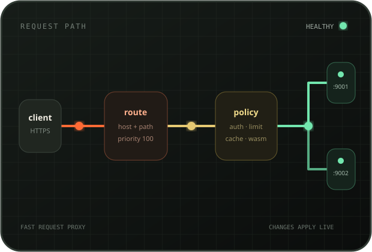

# Raahi

**Raahi is an open-source, self-hosted reverse proxy and API gateway for HTTP, HTTPS, WebSocket, and TCP traffic.**

It routes requests to healthy upstreams and handles TLS, load balancing, authentication, rate limits, caching, traffic splitting, and request transforms. Manage it through the web UI or REST API. Configuration and certificate changes apply without restarting the proxy.

[Documentation](https://raahi.sarat.dev) · [API reference](https://raahi.sarat.dev/api-reference/) · [OpenAPI specification](docs/openapi.yaml)

[](LICENSE)
[](https://github.com/iamd3vil/raahi/actions/workflows/ci.yml)
[](https://www.rust-lang.org/)
[](https://raahi.sarat.dev)

<p align="center">
  
</p>

> [!NOTE]
> Raahi is pre-1.0. The management API and configuration model may change between releases.

## What Raahi handles

- **HTTP and WebSocket routing.** Match exact or wildcard hostnames, path prefixes or regular expressions, methods, and headers.
- **TCP proxying.** Open raw TCP listeners for databases, Redis, and other non-HTTP services.
- **TLS termination.** Select certificates by SNI and replace them while the HTTPS listener remains active.
- **Automatic certificates.** Issue and renew certificates through Let's Encrypt, ZeroSSL, or a custom ACME provider. Cloudflare DNS-01 supports wildcard certificates.
- **Load balancing and health checks.** Use round-robin, weighted, random, or client-IP hashing across healthy targets.
- **Traffic splitting.** Send a controlled share of requests to a canary or replacement service.
- **Authentication and access control.** Apply API key, Basic, JWT, JWKS, ACL, and IP restriction policies.
- **Traffic policy.** Add rate limits, request size limits, redirects, CORS, caching, compression, request IDs, and header or body transforms.
- **Custom WASM plugins.** Run request and response code with a per-call fuel limit.
- **Live observability.** Inspect recent requests, latency percentiles, route and consumer counters, target health, and Prometheus metrics.
- **Backup and restore.** Export the configuration as JSON and restore it in one transaction.

## How it works

Raahi uses four main resources:

- A **service** describes an upstream application and its connection settings.
- A **target** is a server that can handle requests for a service.
- A **route** selects a service by hostname, path, method, or header.
- A **plugin** adds authentication, access rules, caching, limits, transforms, or other policy.

```text
request -> route -> plugins -> load balancer -> healthy target
```

The proxy and management API run in one process. Raahi stores configuration in SQLite. Each successful mutation builds a complete configuration and swaps it into the running proxy before the API response returns.

Raahi uses [Pingora](https://github.com/cloudflare/pingora) for proxying, Axum for the management API, and Svelte for the admin UI.

## Quick start

### Prerequisites

- The latest stable Rust toolchain
- Node.js 22.12 or newer
- `cmake`, Go, Perl, and a C or C++ compiler
- [`just`](https://just.systems/)
- pnpm or npm

On Debian or Ubuntu:

```bash
sudo apt install build-essential cmake golang perl
```

### Build and run

```bash
git clone https://github.com/iamd3vil/raahi.git
cd raahi
just setup
just run-seed
```

Raahi starts these listeners by default:

- HTTP proxy: `http://localhost:8080`
- Admin UI and API: `http://localhost:9080`
- HTTPS bind address: `0.0.0.0:8443`. TLS handshakes require a configured certificate.

The `--seed` flag creates a route backed by `127.0.0.1:9001` and `127.0.0.1:9002`. Start two local servers and send requests through the proxy:

```bash
python3 -m http.server 9001 &
python3 -m http.server 9002 &

curl http://localhost:8080/
curl http://localhost:8080/
```

The requests alternate between the two targets.

> [!IMPORTANT]
> Management authentication is disabled until you create a user or admin token. The admin listener defaults to loopback. Configure authentication and network restrictions before exposing it to another machine.

Read the [quick-start guide](https://raahi.sarat.dev/start-here/quickstart/) to create the first admin and continue configuring Raahi.

## Build a release

Build a release executable linked against the host libc:

```bash
just release
# target/release/raahi
```

Build a static x86-64 Linux archive with the admin UI included:

```bash
uv tool install cargo-zigbuild
just dist
# dist/raahi-v<version>-x86_64-unknown-linux-musl.tar.gz
```

The static build also requires `zig` on `PATH`. See the [installation guide](https://raahi.sarat.dev/start-here/installation/) for setup details and the libclang `stddef.h` workaround.

## Command line

```text
raahi [OPTIONS]
  --db <URL>            SQLite URL             [env RAAHI_DB]
  --http-addr <ADDR>    HTTP proxy listener override
  --https-addr <ADDR>   HTTPS proxy listener override
  --admin-addr <ADDR>   admin listener override
  --ui-dir <DIR>        built admin UI         [env RAAHI_UI_DIR]
  --threads <N>         proxy worker threads   [env RAAHI_THREADS]
  --seed                create the demo service and route when the DB is empty
```

Use `RUST_LOG` to set log levels. The default is `info`.

## Management API

The JSON API lives under `/api/v1`. A running instance publishes:

- OpenAPI document: `/openapi.yaml`
- Interactive API reference: `/docs`
- Health check: `/healthz`
- Prometheus metrics: `/metrics`

```bash
curl -X POST http://127.0.0.1:9080/api/v1/services \
  -H "Authorization: Bearer $RAAHI_TOKEN" \
  -H 'content-type: application/json' \
  -d '{"name":"orders","protocol":"http"}'
```

PUT replaces the complete resource rather than applying a partial update. See the [API guide](https://raahi.sarat.dev/api/overview/) and [interactive reference](https://raahi.sarat.dev/api-reference/).

## Development

Run the backend and UI development server in separate terminals:

```bash
just run-seed
```

```bash
just ui-dev
```

Open `http://localhost:5173`. Vite forwards API and event requests to the management API on port 9080.

Useful checks:

```bash
just fmt-check
just clippy-strict
just test
just ui-check
cd site && npm install && npm run build
```

### Repository layout

| Path | Purpose |
| --- | --- |
| `crates/raahi-core` | Resource types, route matching, and active configuration |
| `crates/raahi-store` | SQLite persistence, migrations, export, and import |
| `crates/raahi-proxy` | HTTP and TCP proxying, plugins, health checks, metrics, and TLS |
| `crates/raahi-api` | Management API, users, sessions, SSO, and admin UI serving |
| `crates/raahi-acme` | ACME accounts, challenges, issuance, and renewal |
| `ui/` | Svelte admin UI |
| `site/` | Astro documentation site |
| `docs/openapi.yaml` | OpenAPI 3.0 contract |

## Current limits

- Raahi runs as a single node with a local SQLite database.
- It does not synchronize configuration across instances.
- It does not proxy gRPC traffic yet.
- Adding, removing, or rebinding a TCP stream listener requires a restart. Retargeting an existing listener applies without a restart.

## Contributing

Issues and pull requests are welcome. For larger changes, open an issue first so the implementation and configuration model can be discussed before work begins.

Please run the checks listed under [Development](#development) before opening a pull request.

## License

Copyright © 2026 Sarat Chandra.

Raahi is licensed under the [GNU General Public License v3.0](LICENSE).
