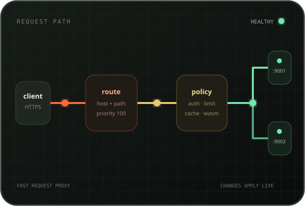

# Raahi

**Raahi is an open-source, self-hosted reverse proxy and API gateway for HTTP, HTTPS, WebSocket, and TCP traffic.**

It routes requests to healthy upstreams and handles TLS, load balancing, authentication, rate limits, caching, traffic splitting, and request transforms. Manage it through the web UI or REST API. Configuration and certificate changes apply without restarting the proxy.

[Documentation](https://raahi.sarat.dev) · [API reference](https://raahi.sarat.dev/api-reference/) · [OpenAPI specification](docs/openapi.yaml)

[](LICENSE)
[](https://github.com/iamd3vil/raahi/actions/workflows/ci.yml)
[](https://www.rust-lang.org/)
[](https://raahi.sarat.dev)

<p align="center">
  
</p>

> [!NOTE]
> Raahi is pre-1.0. The management API and configuration model may change between releases.

## What Raahi handles

- **HTTP and WebSocket routing.** Match exact or wildcard hostnames, path prefixes or regular expressions, methods, and headers.
- **TCP proxying.** Open raw TCP listeners for databases, Redis, and other non-HTTP services.
- **Static hosting.** Serve a local directory on the same HTTP/HTTPS listeners, without another server or port. Supports index pages, SPA fallback, conditional requests, and byte ranges.
- **TLS termination.** Select certificates by SNI and replace them while the HTTPS listener remains active.
- **Automatic certificates.** Issue and renew certificates through Let's Encrypt, ZeroSSL, or a custom ACME provider. Cloudflare DNS-01 supports wildcard certificates.
- **Load balancing and health checks.** Use round-robin, weighted, random, or client-IP hashing across healthy targets.
- **Traffic splitting.** Send a controlled share of requests to a canary or replacement service.
- **Authentication and access control.** Apply API key, Basic, JWT, JWKS, ACL, and IP restriction policies.
- **Traffic policy.** Add rate limits, request size limits, redirects, CORS, caching, compression, request IDs, and header or body transforms.
- **Custom WASM plugins.** Run request and response code with a per-call fuel limit.
- **Live observability.** Inspect recent requests, latency percentiles, route and consumer counters, target health, and Prometheus metrics.
- **Backup and restore.** Export the configuration as JSON and restore it in one transaction.

## How it works

Raahi uses four main resources:

- A **service** describes an upstream application or a local static directory.
- A **target** is a server that can handle requests for a service.
- A **route** selects a service by hostname, path, method, or header.
- A **plugin** adds authentication, access rules, caching, limits, transforms, or other policy.

```text
request -> route -> plugins -> load balancer -> healthy target
```

The proxy and management API run in one process. Raahi stores configuration in SQLite. Each successful mutation builds a complete configuration and swaps it into the running proxy before the API response returns.

Raahi uses [Pingora](https://github.com/cloudflare/pingora) for proxying, Axum for the management API, and Svelte for the admin UI.

### Static sites

In **Services**, select **Static site**, enter an absolute directory path on the
Raahi host, then create a route for its hostname. Static services need no targets.
Existing services remain proxy services by default.

Creating, editing, converting, or deleting a static service requires the Admin
role. Editors can still manage proxy services. Choosing a static root grants read
access to that directory's contents. CRUD, declarative apply, and import reject
`/`, roots under `/proc`, `/sys`, or `/dev`, and roots that contain Raahi's database
directory, including resolved symlink aliases. Run Raahi as a dedicated
unprivileged user with read access only to the files it needs.

The equivalent declarative configuration is:

```yaml
raahi_config: 1
services:
  - name: docs
    kind: static
    root: /srv/www/docs
    spa_fallback: false
routes:
  - name: docs.example.com
    service: docs
    hosts: [docs.example.com]
    paths: [/]
```

Files stream directly through Pingora. Directories serve `index.html`; requests
without a directory's trailing slash redirect to the slash form. To mount a site
under `/docs`, use `paths: [/docs]` and `strip_path: true` on its route.

Enable `spa_fallback` for client-side routing. Missing extensionless paths then
serve the root `index.html`; missing assets such as `.js` and `.css` still return
404. Directory listing, uploads, and executable scripts are not supported.

Request paths with dot-prefixed segments and traversal paths are blocked.
Relative symlinks work only within the root; absolute symlinks and links outside
it are rejected. The Raahi user must be able to read the
directory. The configured root itself may be a deployment symlink, and Raahi
opens it per request so switching that link publishes the new files. Use a
dedicated site directory, not your home directory. Container deployments must
mount the files and use the path inside the container.

Confinement applies when opening files, not just when validating URL strings.
Raahi decodes each path once and rejects malformed escapes, dot segments,
backslashes, and control characters. All file, directory-index, and SPA-fallback
lookups use the same root directory handle, so replacing a symlink between a
metadata check and an open cannot redirect the open outside that root.

Keep the configured root, its parents, and any deployment symlink under trusted
administrative control. This prevents HTTP path traversal; it is not an OS
sandbox against local users who can replace the root or publish sensitive files
inside it through hard links or mounts. Treat the site's file tree as public,
including any in-root symlink targets.

The root restrictions are configuration-time safeguards, not an OS sandbox.
They do not prevent a local administrator from later redirecting a deployment
symlink to a sensitive directory. Non-regular files, including devices, sockets,
and FIFOs, are rejected before a read open. A post-open check prevents streaming
files replaced with non-regular files during lookup. The metadata check and read
open are separate, so local users must not be able to publish device nodes in
the site tree. Read opens also use nonblocking mode and cannot acquire a
controlling terminal.

Declarative apply can convert a proxy to static in one transaction, removing its
targets and discovery sources first. Any stream routes owned by that service
must be removed or moved to a proxy service in the same document's
`stream_routes` section. Omitting that section preserves existing stream routes
and blocks conversion if they still reference the service.

Route plugins also apply to static sites, including authentication, redirects,
response headers, compression, body transforms, and request logging. Partial
responses are not compressed or transformed. If body transformation is enabled,
Raahi serves the full representation without the original file's validators.
The proxy-cache plugin caches static responses for its configured TTL; it does
not watch the filesystem. Purge it after deploying files or leave it disabled.

To run the isolated end-to-end check after `cargo build`, use
`python3 scripts/test-static-hosting.py`. It needs Python 3 and OpenSSL and runs
against a temporary database on loopback, not your live instance.

## Quick start

### Prerequisites

- The latest stable Rust toolchain
- Node.js 22.12 or newer
- `cmake`, Go, Perl, and a C or C++ compiler
- [`just`](https://just.systems/)
- pnpm or npm

For the quickest install, use a release archive or the container image. See [Install a release](#install-a-release).

On Debian or Ubuntu:

```bash
sudo apt install build-essential cmake golang perl
```

### Build and run

```bash
git clone https://github.com/iamd3vil/raahi.git
cd raahi
just setup
just run-seed
```

Raahi starts these listeners by default:

- HTTP proxy: `http://localhost:8080`
- Admin UI and API: `http://localhost:9080`
- HTTPS bind address: `0.0.0.0:8443`. TLS handshakes require a configured certificate.

The `--seed` flag creates a route backed by `127.0.0.1:9001` and `127.0.0.1:9002`. Start two local servers and send requests through the proxy:

```bash
python3 -m http.server 9001 &
python3 -m http.server 9002 &

curl http://localhost:8080/
curl http://localhost:8080/
```

The requests alternate between the two targets.

> [!IMPORTANT]
> Management authentication is disabled until you create a user or admin token. The admin listener defaults to loopback. Configure authentication and network restrictions before exposing it to another machine.

Read the [quick-start guide](https://raahi.sarat.dev/start-here/quickstart/) to create the first admin and continue configuring Raahi.

## Install a release

GitHub Releases publishes Linux archives for amd64 and arm64. Each archive contains the Raahi executable, admin UI, README, and license.

```bash
# Replace amd64 with arm64 when needed.
archive=raahi-v0.3.0-linux-amd64.tar.gz
curl -LO "https://github.com/iamd3vil/raahi/releases/download/v0.3.0/$archive"
curl -LO https://github.com/iamd3vil/raahi/releases/download/v0.3.0/checksums.txt
checksum_line="$(grep -F "$archive" checksums.txt)"
expected="${checksum_line#*$'\t'}"
echo "$expected  $archive" | sha256sum -c -
tar xzf "$archive"
cd "${archive%.tar.gz}"
./raahi --help
```

The multi-architecture container image is published to GitHub Container Registry:

```bash
docker run --rm \
  -p 8080:8080 \
  -p 8443:8443 \
  -p 127.0.0.1:9080:9080 \
  -v raahi-data:/data \
  ghcr.io/iamd3vil/raahi:0.3.0
```

The container stores `raahi.db` in `/data` and serves the bundled admin UI. The command binds the admin listener inside the container and publishes it only on host loopback.

## Build a release

Build a release executable linked against the host libc:

```bash
just release
# target/release/raahi
```

Build a static x86-64 Linux archive with the admin UI included:

```bash
uv tool install cargo-zigbuild
just dist
# dist/raahi-v<version>-x86_64-unknown-linux-musl.tar.gz
```

GitHub Actions builds release archives natively on dedicated amd64 and arm64 runners. Local `just dist` remains an x86-64 musl build for testing static packaging.

## Command line

```text
raahi [OPTIONS]
  --db <URL>            SQLite URL             [env RAAHI_DB]
  --http-addr <ADDR>    HTTP proxy listener override
  --https-addr <ADDR>   HTTPS proxy listener override
  --admin-addr <ADDR>   admin listener override
  --ui-dir <DIR>        built admin UI         [env RAAHI_UI_DIR]
  --threads <N>         proxy worker threads   [env RAAHI_THREADS]
  --seed                create the demo service and route when the DB is empty

raahi apply -f <FILE> [--dry-run]   apply a YAML/HUML/JSON config file
raahi dump [--format yaml|huml|json] print the running config as a file
  --url <URL>           admin API URL          [env RAAHI_URL]
  --token <TOKEN>       admin token            [env RAAHI_TOKEN]
```

Use `RUST_LOG` to set log levels. The default is `info`.

## Management API

The JSON API lives under `/api/v1`. A running instance publishes:

- OpenAPI document: `/openapi.yaml`
- Interactive API reference: `/docs`
- Health check: `/healthz`
- Prometheus metrics: `/metrics`

```bash
curl -X POST http://127.0.0.1:9080/api/v1/services \
  -H "Authorization: Bearer $RAAHI_TOKEN" \
  -H 'content-type: application/json' \
  -d '{"name":"orders","protocol":"http"}'
```

PUT replaces the complete resource rather than applying a partial update. See the [API guide](https://raahi.sarat.dev/api/overview/) and [interactive reference](https://raahi.sarat.dev/api-reference/).

To keep configuration in git, write it as a YAML or HUML file and apply it with `raahi apply`. The [config files guide](https://raahi.sarat.dev/guides/config-files/) covers the format.

## Development

Run the backend and UI development server in separate terminals:

```bash
just run-seed
```

```bash
just ui-dev
```

Open `http://localhost:5173`. Vite forwards API and event requests to the management API on port 9080.

Useful checks:

```bash
just fmt-check
just clippy-strict
just test
just ui-check
cd site && npm install && npm run build
```

### Repository layout

| Path | Purpose |
| --- | --- |
| `crates/raahi-core` | Resource types, route matching, and active configuration |
| `crates/raahi-store` | SQLite persistence, migrations, export, and import |
| `crates/raahi-proxy` | HTTP and TCP proxying, plugins, health checks, metrics, and TLS |
| `crates/raahi-api` | Management API, users, sessions, SSO, and admin UI serving |
| `crates/raahi-acme` | ACME accounts, challenges, issuance, and renewal |
| `crates/raahi-discovery` | Service discovery providers for DNS, SRV, and HTTP registries |
| `ui/` | Svelte admin UI |
| `site/` | Astro documentation site |
| `docs/openapi.yaml` | OpenAPI 3.0 contract |

## Release notes

- Config files. Write services, routes, plugins, consumers, and certificates in a YAML, HUML, or JSON file and apply it with `raahi apply`. See the [config files guide](https://raahi.sarat.dev/guides/config-files/).
- `raahi dump` prints the running configuration as a file to start from.
- No database migrations. `raahi` without a subcommand still starts the server.
- Native Linux archives for amd64 and arm64.
- Multi-architecture container image at `ghcr.io/iamd3vil/raahi:0.3.0` and `ghcr.io/iamd3vil/raahi:latest`.
- GitHub release publishing through [rlsr](https://rlsr.sarat.dev/).

## Current limits

- Raahi runs as a single node with a local SQLite database.
- It does not synchronize configuration across instances.
- It does not proxy gRPC traffic yet.
- Adding, removing, or rebinding a TCP stream listener requires a restart. Retargeting an existing listener applies without a restart.

## Contributing

Issues and pull requests are welcome. For larger changes, open an issue first so the implementation and configuration model can be discussed before work begins.

Please run the checks listed under [Development](#development) before opening a pull request.

## License

Copyright © 2026 Sarat Chandra.

Raahi is licensed under the [GNU General Public License v3.0](LICENSE).
